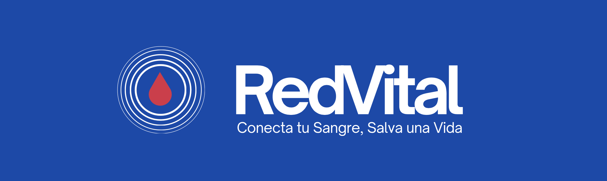

# RedVital

## - Gestor de Donaciones de Sangre -

## Descripción

Aplicación web para facilitar la conexión entre hospitales y donantes de sangre en tiempo real.  
El sistema busca reducir tiempos de respuesta y mejorar la coordinación de donaciones mediante notificaciones inmediatas y segmentadas.

## Estado del Proyecto

Proyecto académico de la asignatura **Sistemas Web I**.  
Actualmente en fase de **definición y diseño**.

## Equipo

- Pilar Bourg
- Olivia Gallego
- Elena Morales
- Alejandra O’Shea
- Marta Sánchez
- Josefina Silva

## Ejecución
